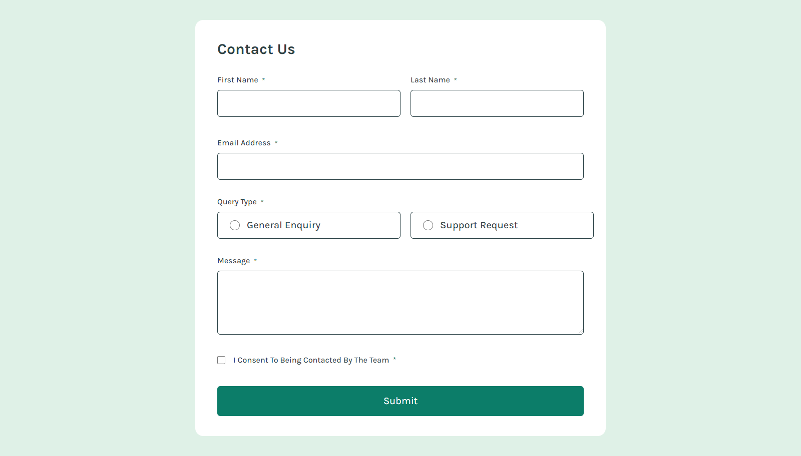

# Frontend Mentor - Contact form solution

This is a solution to the [Contact form challenge on Frontend Mentor](https://www.frontendmentor.io/challenges/contact-form--G-hYlqKJj). Frontend Mentor challenges help you improve your coding skills by building realistic projects.

## Table of contents

- [Overview](#overview)
  - [The challenge](#the-challenge)
  - [Screenshot](#screenshot)
  - [Links](#links)
- [Built with](#built-with)
- [Author](#author)

## Overview

### The challenge

Users should be able to:

- Complete the form and see a success toast message upon successful submission
- Receive form validation messages if:
  - A required field has been missed
  - The email address is not formatted correctly
- Complete the form only using their keyboard
- Have inputs, error messages, and the success message announced on their screen reader
- View the optimal layout for the interface depending on their device's screen size
- See hover and focus states for all interactive elements on the page

### Screenshot

### Links

- Solution URL: [Frontend Mentor Solutions](https://www.frontendmentor.io/solutions/contact-form-Zqz7KizyW5)
- Live Site URL: [Github pages](https://sam4web.github.io/contact-form/)

## Built with

- [Vue](https://vuejs.org/) - JavaScript Framework
- [Tailwind](https://tailwindcss.com/) - CSS framework
- SCSS
- Mobile-first workflow

## Author

- Website: [Sijal Manandhar](https://sijalmanandhar.com.np/)
- Frontend Mentor: [@sam4web](https://www.frontendmentor.io/profile/sam4web)
- Github: [@sam4web](https://github.com/sam4web)
